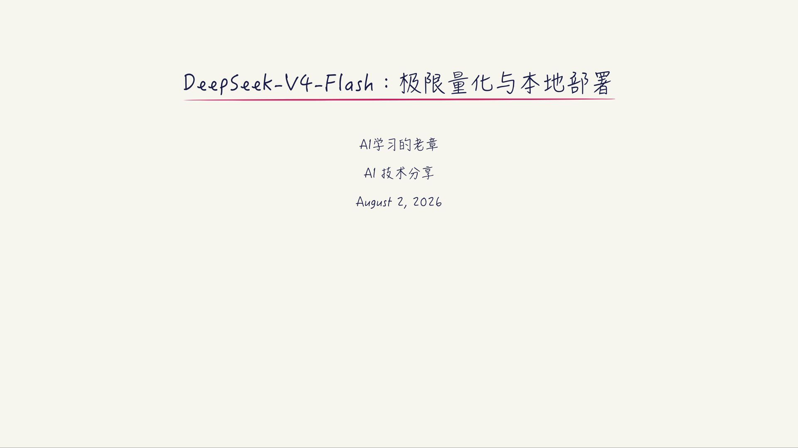
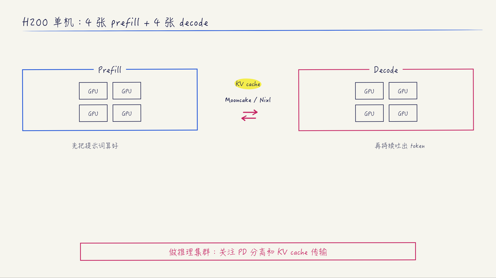

# z-wanghong-handwritten-ppt

把文章、讲稿或技术主题制作成 16:9 的 Notability 学术手写风 HTML 幻灯片，并逐页导出 PNG。

这套 skill 重点保留三件事：极简封面、连续清楚的逻辑链，以及工整但有手写温度的图表和标注。





## 典型触发

- 王虹PPT风格
- 王虹手写PPT
- Notability学术手写幻灯片
- 手写网页PPT
- 数学家手写报告风

## 目录

- `SKILL.md`：完整执行流程
- `templates/deck.html`：基础模板
- `assets/`：公共样式、翻页能力、neat-annotations 和预览图
- `examples/deepseek-v4-flash/`：19 页完整示例
- `references/style-guide.md`：风格拆解与两套提示词
- `scripts/`：结构检查和 PNG 导出
- `evals/`：典型任务样例

## 快速检查

```bash
python3 scripts/check_deck.py examples/deepseek-v4-flash/index.html
scripts/render.sh \
  examples/deepseek-v4-flash/index.html \
  all \
  /tmp/wanghong-ppt-png \
  /absolute/path/to/Hanzipen.ttc
```

导出需要 macOS 上的 Google Chrome，以及字体册提供的“翩翩体-简”。脚本会锁定使用预览封面的同一字形，字体加载失败时不会继续导出。
